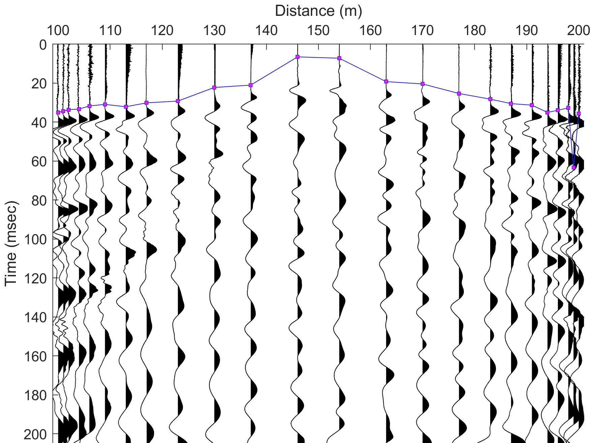
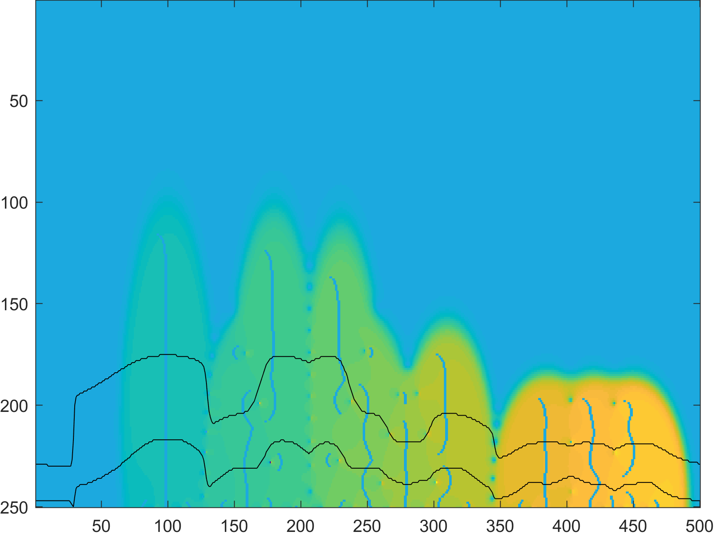

# Travel-time picking
## First-break picking

## Event picking

## References
* •	Bejvani M., A. Gholami, (2015) “Adaptive STFT and its application for automatic traveltime picking”, 2nd Seminar of Petroleum Geophysical Exploration, Tehran, Iran.
